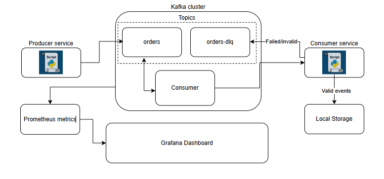
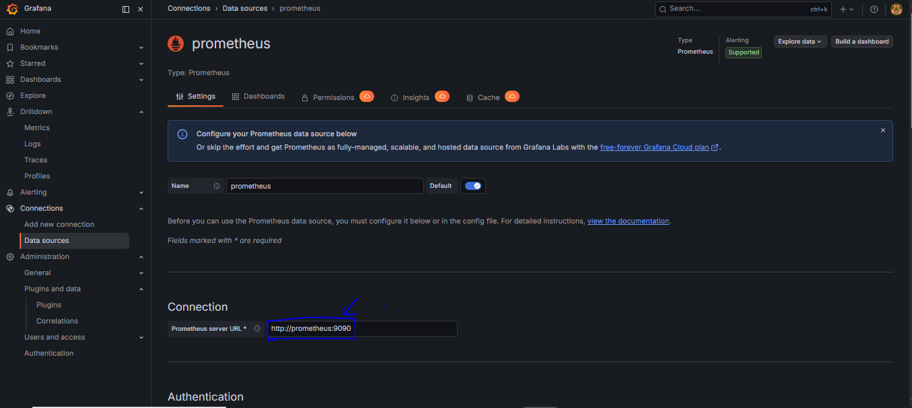
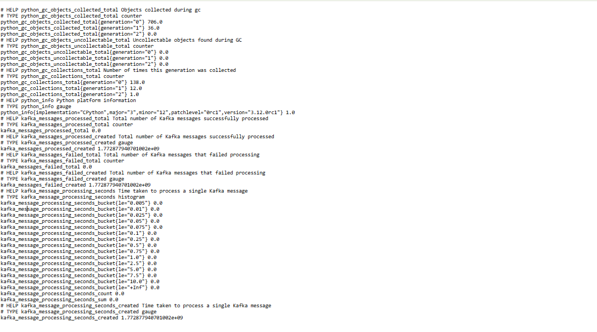
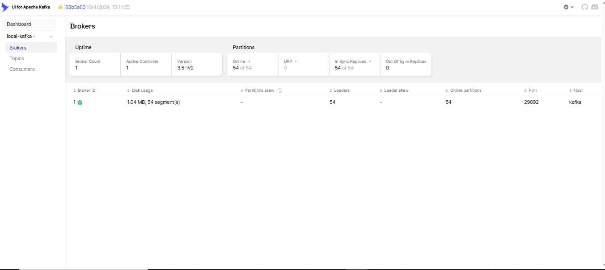
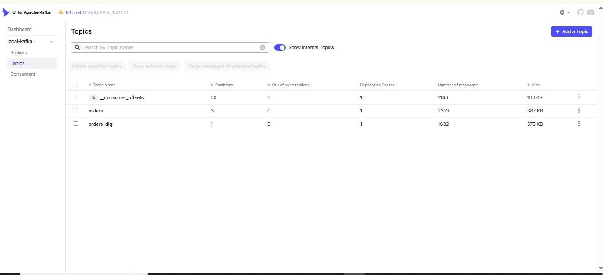
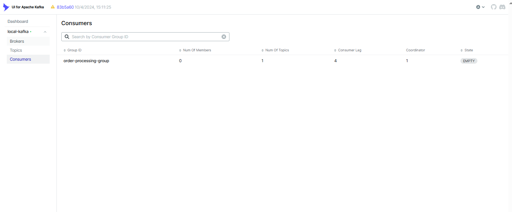
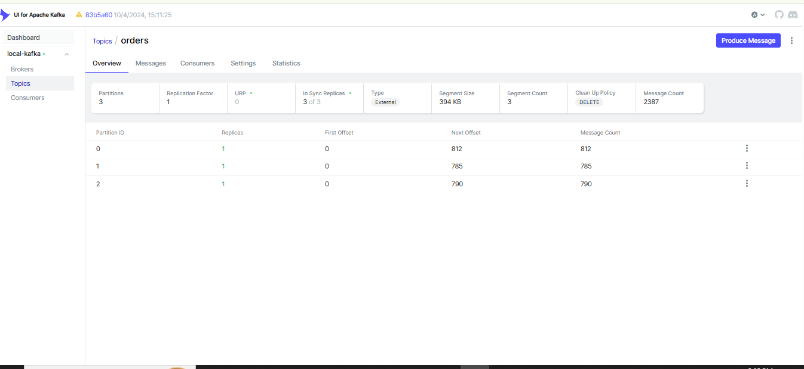
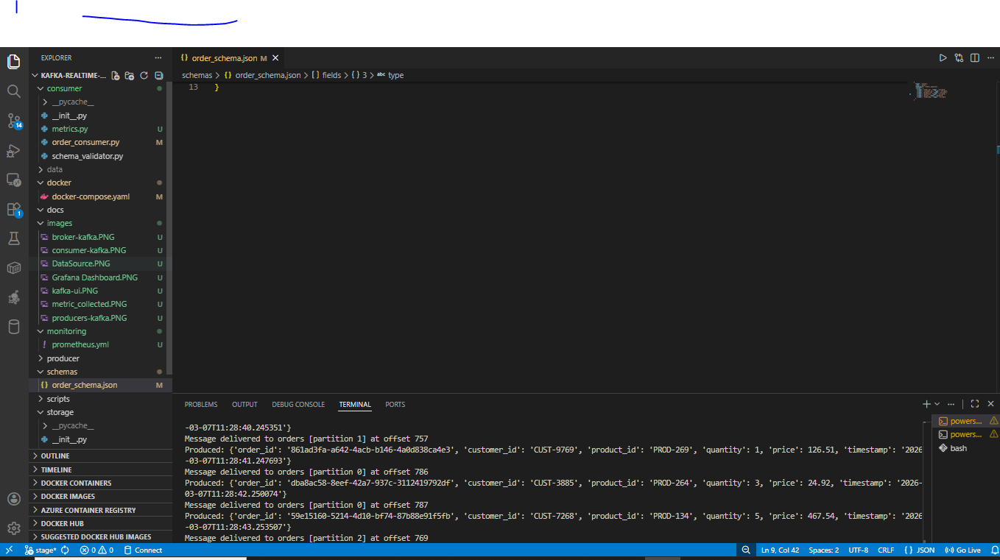
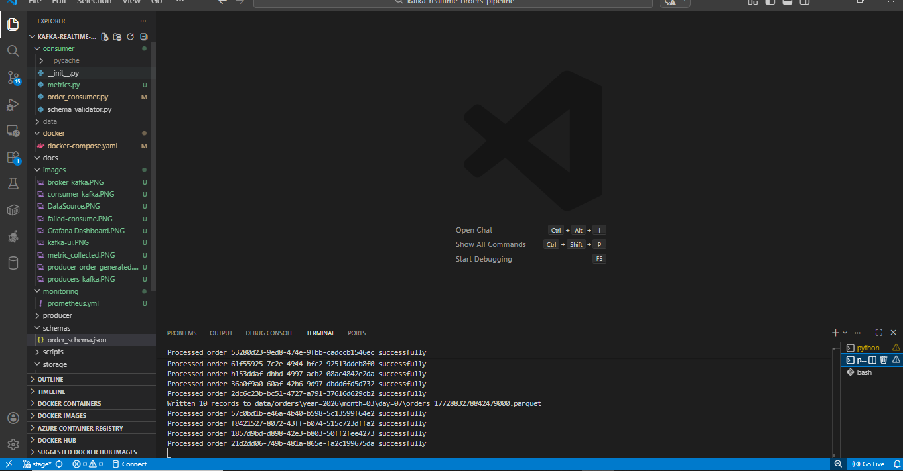
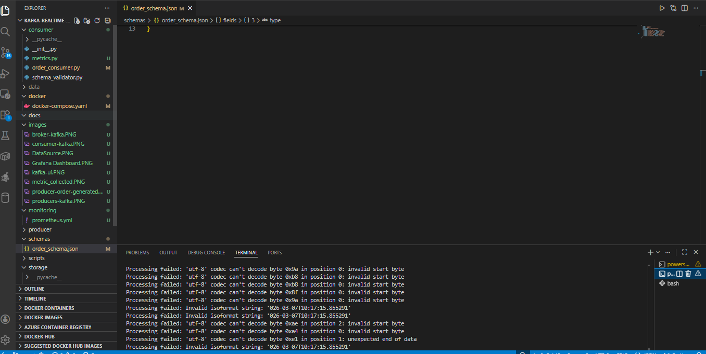

# Kafka Real-Time Orders Pipeline

## Overview

This project demonstrates how to build a small real-time data pipeline using **Apache Kafka and Python**.

The goal was not just to run Kafka locally, but to understand how streaming systems work in practice by implementing a complete pipeline from event generation to data storage.

The pipeline simulates a retail system where order events are generated continuously and processed in real time. Valid events are stored as analytics-ready files while invalid events are isolated safely.

This repository is part of a learning initiative to gain hands-on experience with **event-driven architecture and streaming data systems**.

---

# Architecture

The system is composed of a few simple services that work together.

```
Producer (Python)
      │
      ▼
Kafka Topic (orders)
      │
      ▼
Consumer Processing Service
      │
      ├── Valid Events → Partitioned Parquet Data Lake
      │
      └── Failed Events → Dead Letter Queue
```


### Components

**Producer**

Simulates incoming retail order events and publishes them to Kafka.

**Kafka**

Acts as the event streaming platform that stores and distributes messages.

**Consumer**

Processes events from Kafka, validates them, and stores valid records.

**Dead Letter Queue**

A separate topic used to store events that fail validation or processing.

**Storage Layer**

Processed events are written to Parquet files in a partitioned data layout.

---

# Project Structure

```
kafka-realtime-orders-pipeline
│
├── producer
│   └── order_producer.py
│
├── consumer
│   ├── order_consumer.py
│   ├── metrics.py
│   └── schema_validator.py
│
├── storage
│   └── parquet_writer.py
│
├── schemas
│   └── order_schema.json
│
├── scripts
│   └── create_topics.sh
│
├── monitoring
│   └── prometheus.yml
│
├── docker
│   └── docker-compose.yml
│
└── README.md
```

Each directory represents a different responsibility in the system.

---

# Implementation Walkthrough

The system was built incrementally to understand each piece of the pipeline.

---

## Step 1 — Project Setup

The repository structure was designed first to separate responsibilities.

```
producer → event generation  
consumer → event processing  
storage → writing data to disk  
schemas → event definitions
```

This keeps the project organized and easier to extend later.

---

## Step 2 — Local Kafka Environment

Kafka was set up locally using Docker Compose.

The environment includes:

* Zookeeper
* Kafka Broker
* Kafka UI for inspecting topics

Running Kafka locally allows quick testing without needing external infrastructure.

---

## Step 3 — Topic Design

Two Kafka topics were created.

```
orders
orders_dlq
```

`orders` carries the main stream of events.

`orders_dlq` stores failed events that could not be processed.

The main topic was created with multiple partitions so the system can scale later if more consumers are added.

---

## Step 4 — Event Producer

A Python producer generates simulated order events.

Each event contains:

```
order_id
customer_id
product_id
quantity
price
timestamp
```

Events are continuously published to the Kafka `orders` topic.

The partition key is based on `customer_id` so that events from the same customer are processed in order.

---

## Step 5 — Consumer Processing Service

A Kafka consumer service reads events from the topic.

The consumer performs the following tasks:

1. Reads messages from Kafka
2. Deserializes the event
3. Validates the event structure
4. Processes valid events
5. Sends invalid events to a Dead Letter Queue

The consumer runs inside a **consumer group**, which allows the system to scale by adding more consumers.

---

## Step 6 — Schema-Based Events

Instead of sending plain JSON, the pipeline uses **Avro serialization**.

The schema is defined in:

```
schemas/order_schema.json
```

The producer serializes events using this schema and the consumer uses the same schema to deserialize them.

This ensures both sides follow the same data contract.

---

## Step 7 — Dead Letter Queue

If an event fails validation or processing, it is not discarded.

Instead, the event is sent to the `orders_dlq` topic with a reason describing the failure.

This approach ensures:

* the main pipeline continues running
* bad events can be inspected later
* no data is silently lost

---

## Step 8 — Writing Events to Parquet

Valid events are written to Parquet files.

Events are first buffered and then written in batches to avoid creating too many small files.

Parquet was chosen because it is widely used in modern analytics systems.

---

## Step 9 — Partitioned Data Lake Layout

The storage layer writes data using a partitioned folder structure based on the event timestamp.

Example:

```
data/orders/
   year=2026/
      month=03/
         day=05/
            orders_*.parquet
```

This layout allows analytics engines to scan only the relevant partitions when querying data.

---

# Challenges Encountered and Solutions

During development several practical issues appeared.

---

### Kafka UI Could Not Connect to Kafka

Kafka UI initially kept loading and showed connection errors.

Cause
Containers inside Docker cannot access Kafka using `localhost`.

Solution
Kafka was configured with two listeners:

```
localhost:9092
kafka:29092
```

One is used by local applications and the other by containers inside Docker.

---

### Python Import Errors Between Modules

The consumer could not import modules from other directories.

Cause
Running Python scripts directly changes how Python resolves modules.

Solution
Scripts are executed as modules from the project root.

```
python -m producer.order_producer
python -m consumer.order_consumer
```

---

### Topics Disappearing After Restart

Kafka topics disappeared after restarting containers.

Cause
Docker volumes storing Kafka metadata were removed.

Solution
Topics are recreated using a helper script.

```
scripts/create_topics.sh
```

---

### Binary Messages in Kafka UI

After switching to Avro serialization, Kafka UI displayed unreadable binary messages.

Cause
Avro messages are stored in binary format.

Solution
This is expected. Messages are decoded correctly by the consumer using the schema.

---

# Running the Project Locally

## 1 Start Kafka

```
docker compose -f docker/docker-compose.yml up -d
```

Kafka UI will be available at:

```
http://localhost:8080
```

---

## 2 Create Topics

```
./scripts/create_topics.sh
```

---

## 3 Install Dependencies

```
pip install -r requirements.txt
```

---

## 4 Run Producer

From project root:

```
python -m producer.order_producer
```

---

## 5 Run Consumer

Open another terminal and run:

```
python -m consumer.order_consumer
```

The consumer will start processing events and writing data to the local data lake.

---

# Example Output Data

After the pipeline runs, the storage folder will look like this.

```
data/orders/
   year=2026/
      month=03/
         day=05/
            orders_*.parquet
```

Each file contains a batch of processed order events.

---
# Results
---












# Future Improvements

Possible extensions for this project include:

* metrics and monitoring using Prometheus
* deploying Kafka on cloud infrastructure
* using a schema registry
* adding automated tests
* containerizing the producer and consumer services

---

# Summary

This project demonstrates how a simple event-driven pipeline can be built using Kafka and Python.
It covers the full flow from generating events to storing processed data, while handling failures safely.
Although simplified, the architecture reflects many patterns used in real streaming data systems.
